# Exploratory Data Analysis Summary — Nepal Earthquake Building Damage

This document summarizes the exploratory data analysis (EDA) performed on the building-damage dataset in `assets/use_case_eda.ipynb`, covering Sections 1 through 9 of the notebook. The goal of the underlying task is to predict `damage_grade` (1, 2, or 3) sustained by a building during the earthquake, based on its structural, geographic, and ownership characteristics.

---

## Dataset Overview

| Dataset          |    Rows | Columns |
| ---------------- | ------: | ------: |
| `train_values` | 260,601 |      39 |
| `train_labels` | 260,601 |       2 |
| `test_values`  |  86,868 |      39 |

The train/test split is **75% / 25%** of the combined 347,469 records.

**Column groups used throughout the analysis:**

- **ID / Target:** `building_id`, `damage_grade`
- **Geographic (hierarchical):** `geo_level_1_id`, `geo_level_2_id`, `geo_level_3_id`
- **Numeric:** the geo levels plus `count_floors_pre_eq`, `age`, `area_percentage`, `height_percentage`, `count_families`
- **Categorical (8 columns):** `land_surface_condition`, `foundation_type`, `roof_type`, `ground_floor_type`, `other_floor_type`, `position`, `plan_configuration`, `legal_ownership_status`
- **Binary superstructure flags (11 columns):** material/construction type indicators (e.g. `has_superstructure_mud_mortar_stone`)
- **Binary secondary-use flags (11 columns):** an umbrella flag `has_secondary_use` plus 10 sub-flags describing what else the building is used for

---

## Section 1 — Shapes and Key Alignment

| Check                                                                           | Result                     |
| ------------------------------------------------------------------------------- | -------------------------- |
| `train_values` shape                                                          | 260,601 rows × 39 columns |
| `train_labels` shape                                                          | 260,601 rows × 2 columns  |
| `test_values` shape                                                           | 86,868 rows × 39 columns  |
| `building_id` unique in train                                                 | ✅ True                    |
| `building_id` unique in test                                                  | ✅ True                    |
| Overlap of`building_id` between train and test                                | 0                          |
| `train_values` / `train_labels` aligned by `building_id` (same row order) | ✅ True                    |

**Interpretation:** The data is well-formed at the structural level — no ID collisions between train and test, no duplicate IDs within either set, and the labels line up row-for-row with the feature table. No re-indexing or join is required before merging labels onto features.

---

## Section 2 — Missing Values

| Dataset          | Total missing values |
| ---------------- | -------------------: |
| `train_values` |                    0 |
| `train_labels` |                    0 |
| `test_values`  |                    0 |

**Interpretation:** There is no missing-data problem anywhere in the dataset. No imputation strategy is needed — this simplifies preprocessing considerably compared to a typical real-world tabular dataset.

---

## Section 3 — Duplicate Rows

| Check                                                                               |  Count |
| ----------------------------------------------------------------------------------- | -----: |
| Fully duplicated rows (including`building_id`)                                    |      0 |
| Duplicated**feature** rows (identical on every column except `building_id`) | 28,544 |

**Interpretation:** No two rows are true duplicates (every `building_id` is unique), but **28,544 rows (~11% of train)** share an identical feature profile with at least one other building. This is expected: the feature space is dominated by low-cardinality categorical and binary columns, so many structurally similar buildings (same foundation, same floor counts, same materials, same location bucket) will look identical on features alone even though they are genuinely different buildings. This is not a data-quality defect and rows were not dropped solely on this basis, although it is revisited during the outlier/cleaning pass later in the notebook.

---

## Section 4 — Target Distribution (`damage_grade`)

| damage_grade                 |   Count | % of train |
| ---------------------------- | ------: | ---------: |
| 1 (low damage)               |  25,124 |      9.64% |
| 2 (medium damage)            | 148,259 |     56.89% |
| 3 (heavy damage / destroyed) |  87,218 |     33.47% |

**Interpretation:** The target is **imbalanced** — grade 2 accounts for well over half of all buildings, while grade 1 is a clear minority class (< 10%). This has two direct modeling consequences:

- **Accuracy is a misleading metric** — a model that always predicts grade 2 would score ~57% accuracy while being useless for grades 1 and 3.
- **Micro-F1** (the competition's actual scoring metric) is the appropriate objective, and class-imbalance-aware techniques (class weighting, stratified sampling/CV, appropriate encoding) should be used.

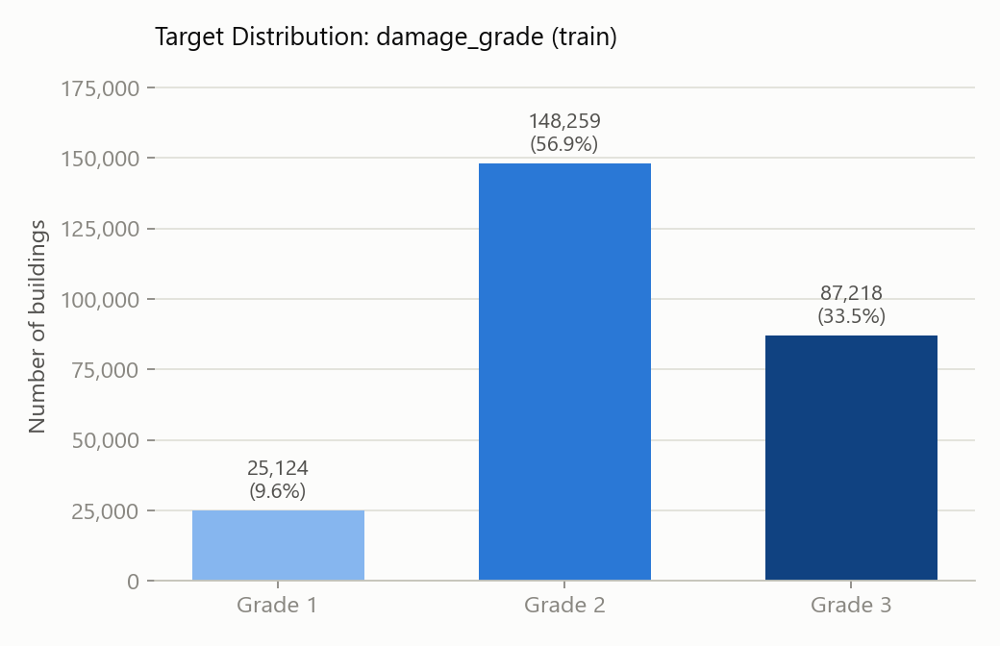

---

## Section 5 — Geographic Features (`geo_level_1/2/3_id`)

Cardinality across train + test combined:

| Column             | Unique values | Min |    Max |
| ------------------ | ------------: | --: | -----: |
| `geo_level_1_id` |            31 |   0 |     30 |
| `geo_level_2_id` |         1,418 |   0 |  1,427 |
| `geo_level_3_id` |        11,861 |   0 | 12,567 |

**Hierarchy nesting consistency** (i.e., does each finer-grained region belong to exactly one coarser region?):

| Check                                                                 | Result     |
| --------------------------------------------------------------------- | ---------- |
| `geo_level_2_id` values mapping to more than one `geo_level_1_id` | 0 / 1,418  |
| `geo_level_3_id` values mapping to more than one `geo_level_2_id` | 0 / 11,861 |

**Unseen categories in test** (not present anywhere in train):

| Column             | Unseen | Total test-side unique |
| ------------------ | -----: | ---------------------: |
| `geo_level_1_id` |      0 |                     31 |
| `geo_level_2_id` |      4 |                  1,364 |
| `geo_level_3_id` |    266 |                 10,213 |

**Interpretation:** The three geo levels form a **clean, perfectly nested hierarchy** (region → district → municipality-like unit), with no cross-contamination between branches. However, cardinality explodes at the finest level (`geo_level_3_id` has ~11,861 distinct values), and a non-trivial number of `geo_level_3_id` values in the test set (266, or ~2.6% of test-side unique values) were **never seen during training**. This rules out simple one-hot encoding for the geo columns and motivates the **out-of-fold target encoding** approach used later in the preprocessing pipeline, which degrades gracefully to a smoothed prior for unseen categories rather than failing outright.

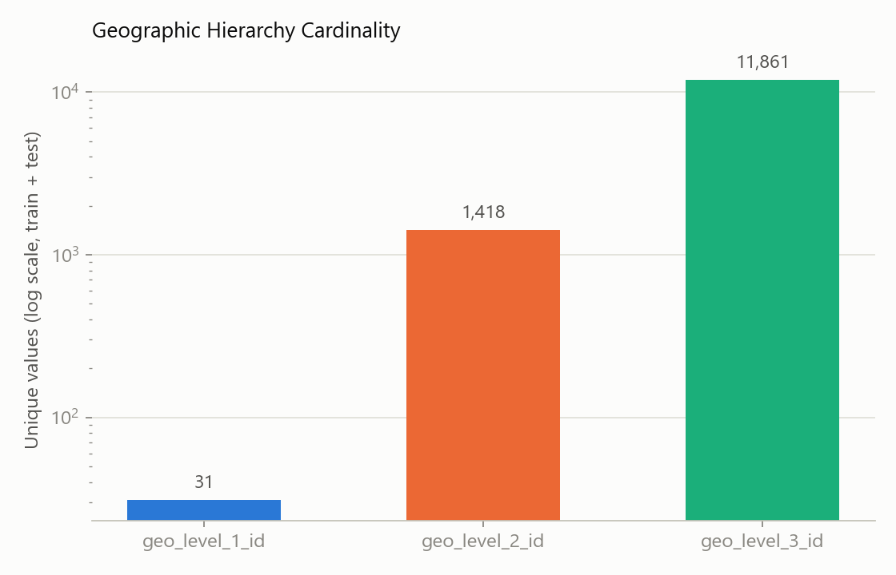

---

## Section 6 — Numeric Feature Summary

| Feature                 |   count |     mean |      std | min |   25% |   50% |   75% |           max |
| ----------------------- | ------: | -------: | -------: | --: | ----: | ----: | ----: | ------------: |
| `geo_level_1_id`      | 260,601 |    13.90 |     8.03 |   0 |     7 |    12 |    21 |            30 |
| `geo_level_2_id`      | 260,601 |   701.07 |   412.71 |   0 |   350 |   702 | 1,050 |         1,427 |
| `geo_level_3_id`      | 260,601 | 6,257.88 | 3,646.37 |   0 | 3,073 | 6,270 | 9,412 |        12,567 |
| `count_floors_pre_eq` | 260,601 |     2.13 |     0.73 |   1 |     2 |     2 |     2 |             9 |
| `age`                 | 260,601 |    26.54 |    73.57 |   0 |    10 |    15 |    30 | **995** |
| `area_percentage`     | 260,601 |     8.02 |     4.39 |   1 |     5 |     7 |     9 |           100 |
| `height_percentage`   | 260,601 |     5.43 |     1.92 |   2 |     4 |     5 |     6 |            32 |
| `count_families`      | 260,601 |     0.98 |     0.42 |   0 |     1 |     1 |     1 |             9 |

**`age` outlier flag:** 1,390 rows have `age == 995` (and 1,496 rows in total have `age >= 200`).

**Interpretation:** `age`'s maximum value of 995 combined with a standard deviation (73.6) that dwarfs the median (15) is a strong signal that **995 is a placeholder/censoring code** (e.g., "unknown" or "very old, capped") rather than a genuine building age. Its presence heavily skews the distribution and is treated as an outlier to be removed at the cleaning stage rather than a real measurement. The other numeric columns look reasonably well-behaved, though `area_percentage` and `height_percentage` still show long right tails worth checking with IQR-based outlier detection (done later in the notebook).

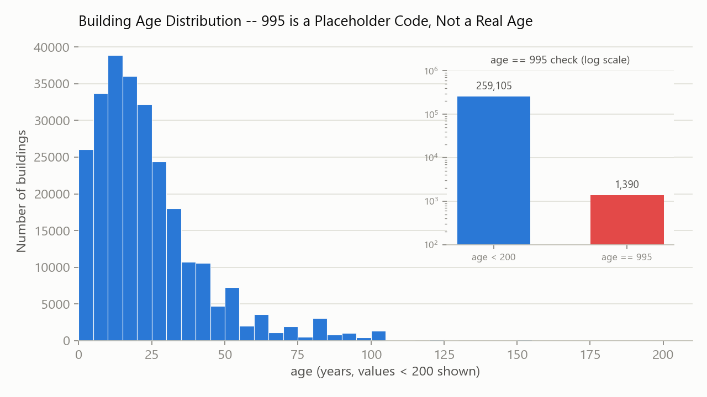

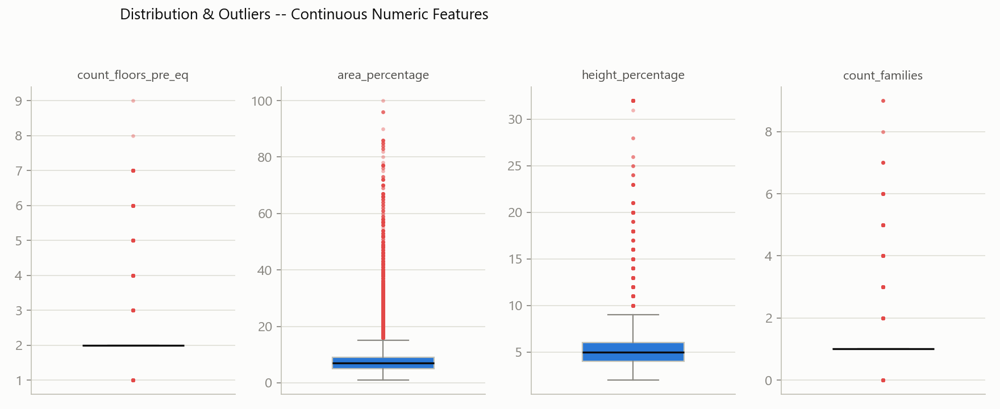

---

## Section 7 — Categorical Feature Value Counts

All 8 categorical columns were checked for their value distribution in train and for categories in test that were never seen in train.

**`land_surface_condition`** — 3 unique values, no unseen categories in test

| Value |   Count |
| ----- | ------: |
| t     | 216,757 |
| n     |  35,528 |
| o     |   8,316 |

**`foundation_type`** — 5 unique values, no unseen categories in test

| Value |   Count |
| ----- | ------: |
| r     | 219,196 |
| w     |  15,118 |
| u     |  14,260 |
| i     |  10,579 |
| h     |   1,448 |

**`roof_type`** — 3 unique values, no unseen categories in test

| Value |   Count |
| ----- | ------: |
| n     | 182,842 |
| q     |  61,576 |
| x     |  16,183 |

**`ground_floor_type`** — 5 unique values, no unseen categories in test

| Value |   Count |
| ----- | ------: |
| f     | 209,619 |
| x     |  24,877 |
| v     |  24,593 |
| z     |   1,004 |
| m     |     508 |

**`other_floor_type`** — 4 unique values, no unseen categories in test

| Value |   Count |
| ----- | ------: |
| q     | 165,282 |
| x     |  43,448 |
| j     |  39,843 |
| s     |  12,028 |

**`position`** — 4 unique values, no unseen categories in test

| Value |   Count |
| ----- | ------: |
| s     | 202,090 |
| t     |  42,896 |
| j     |  13,282 |
| o     |   2,333 |

**`plan_configuration`** — 10 unique values, no unseen categories in test

| Value |   Count |
| ----- | ------: |
| d     | 250,072 |
| q     |   5,692 |
| u     |   3,649 |
| s     |     346 |
| c     |     325 |
| a     |     252 |
| o     |     159 |
| m     |      46 |
| n     |      38 |
| f     |      22 |

**`legal_ownership_status`** — 4 unique values, no unseen categories in test

| Value |   Count |
| ----- | ------: |
| v     | 250,939 |
| a     |   5,512 |
| w     |   2,677 |
| r     |   1,473 |

**Interpretation:** Every categorical column is **low cardinality (3–10 levels)** and, importantly, **no unseen categories appear in test for any of these 8 columns** — unlike the geo levels. This makes one-hot encoding a safe, low-risk choice for these columns (as used later in preprocessing). Several columns are heavily dominated by a single category (e.g., `foundation_type = r` at 84%, `plan_configuration = d` at 96%, `legal_ownership_status = v` at 96%), meaning the discriminative signal in these columns is concentrated in the minority levels.

---

## Section 8 — Binary Flag Features

**Superstructure material flags — prevalence (mean = fraction of buildings with that flag = 1):**

| Flag                    | Prevalence |
| ----------------------- | ---------: |
| `mud_mortar_stone`    |      76.2% |
| `timber`              |      25.5% |
| `adobe_mud`           |       8.9% |
| `bamboo`              |       8.5% |
| `cement_mortar_brick` |       7.5% |
| `mud_mortar_brick`    |       6.8% |
| `rc_non_engineered`   |       4.3% |
| `stone_flag`          |       3.4% |
| `cement_mortar_stone` |       1.8% |
| `rc_engineered`       |       1.6% |
| `other`               |       1.5% |

**Number of superstructure flags set per building:**

| # flags set | # buildings |
| ----------: | ----------: |
|           1 |     176,016 |
|           2 |      57,838 |
|           3 |      20,210 |
|           4 |       4,925 |
|           5 |       1,259 |
|           6 |         314 |
|           7 |          35 |
|           8 |           4 |

**Secondary-use flags — prevalence:**

| Flag                             | Prevalence |
| -------------------------------- | ---------: |
| `has_secondary_use` (umbrella) |      11.2% |
| `agriculture`                  |       6.4% |
| `hotel`                        |       3.4% |
| `rental`                       |       0.8% |
| `other`                        |       0.5% |
| `industry`                     |       0.1% |
| `institution`                  |      0.09% |
| `school`                       |      0.04% |
| `health_post`                  |      0.02% |
| `gov_office`                   |      0.01% |
| `use_police`                   |     0.009% |

**Consistency check:** mismatches between `has_secondary_use` and the logical OR of its 10 sub-flags: **0**.

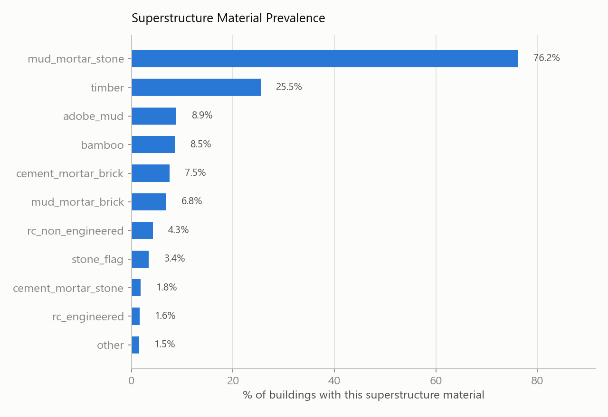

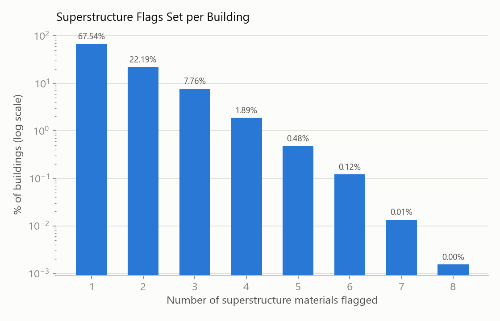

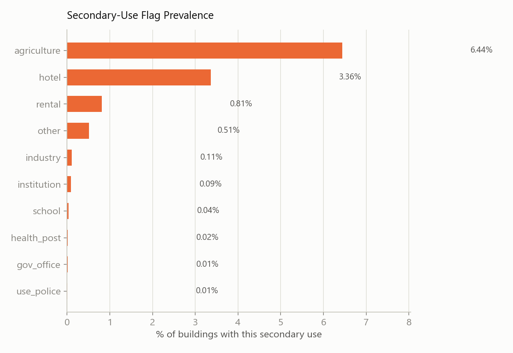

**Interpretation:** Most buildings (68%) report only a single superstructure material, with `mud_mortar_stone` dominating overwhelmingly — a strong prior reflecting local construction practice. The `has_secondary_use` umbrella flag is **perfectly self-consistent** with its sub-flags (0 mismatches), confirming the data was engineered correctly and the umbrella flag can be trusted as a reliable rollup. Several secondary-use sub-flags are extremely rare (<0.1%) and carry little standalone predictive value at this sample size.

---

## Section 9 — Bivariate Signal Check with Target

**`damage_grade` distribution by `foundation_type` (row %):**

| foundation_type |         Grade 1 | Grade 2 | Grade 3 |
| --------------- | --------------: | ------: | ------: |
| h               |           24.7% |   40.0% |   35.3% |
| i               | **56.8%** |   41.2% |    2.1% |
| r               |            4.9% |   57.3% |   37.8% |
| u               |           25.9% |   59.9% |   14.2% |
| w               |           28.8% |   61.3% |    9.9% |

**`damage_grade` distribution by `geo_level_1_id` (row %, first 8 regions shown):**

| geo_level_1_id | Grade 1 | Grade 2 | Grade 3 |
| -------------: | ------: | ------: | ------: |
|              0 |    8.4% |   76.7% |   14.9% |
|              1 |   15.2% |   73.5% |   11.3% |
|              2 |    9.1% |   65.5% |   25.3% |
|              3 |    3.2% |   60.3% |   36.4% |
|              4 |    3.6% |   76.6% |   19.8% |
|              5 |   16.6% |   74.9% |    8.6% |
|              6 |    8.6% |   66.5% |   24.8% |
|              7 |    5.4% |   59.4% |   35.2% |

**Pearson correlation of numeric features with `damage_grade`:**

| Feature                 | Correlation |
| ----------------------- | ----------: |
| `count_floors_pre_eq` |      +0.122 |
| `count_families`      |      +0.056 |
| `height_percentage`   |      +0.048 |
| `geo_level_2_id`      |      +0.043 |
| `age`                 |      +0.029 |
| `geo_level_3_id`      |      +0.008 |
| `geo_level_1_id`      |     −0.072 |
| `area_percentage`     |     −0.125 |

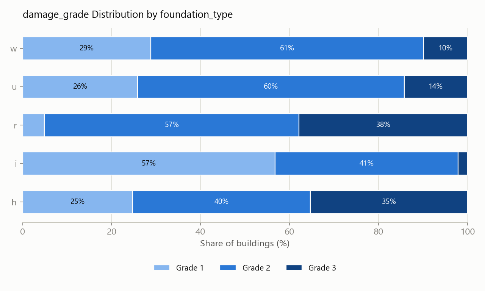

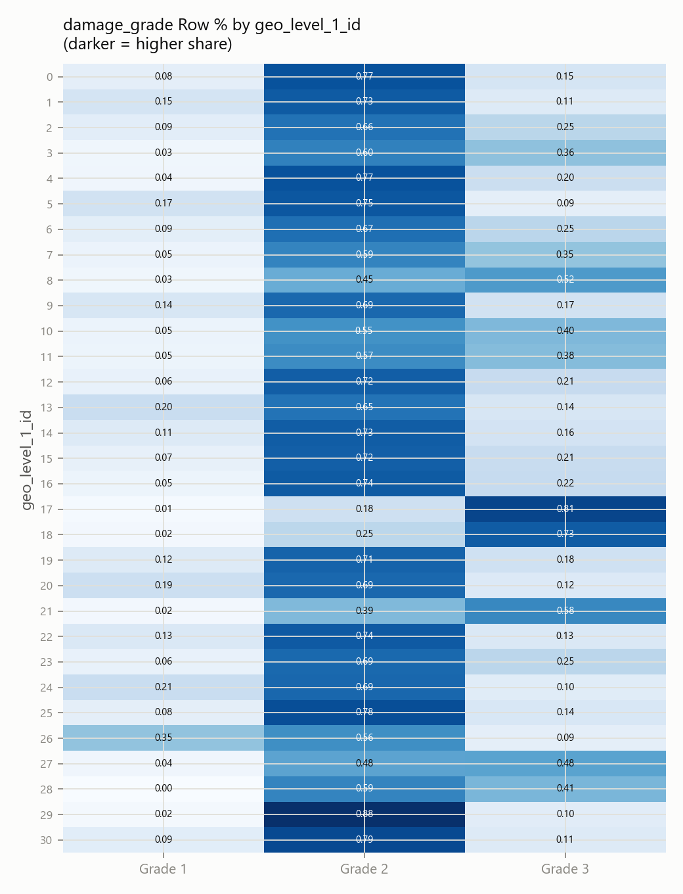

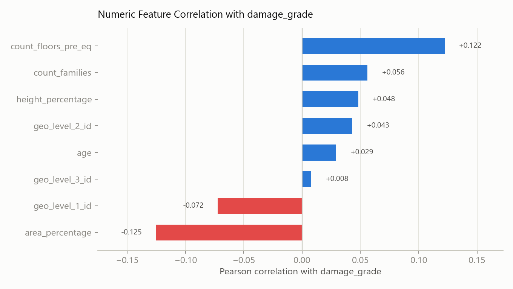

**Interpretation:**

- **`foundation_type` is a strong predictor.** Foundation type `i` is associated with overwhelmingly low damage (57% grade 1, only 2% grade 3), while `r` — the most common foundation type by far (84% of buildings) — skews toward the highest damage (38% grade 3). This single categorical column carries a lot of the discriminative signal in the dataset.
- **Location matters.** Damage-grade distribution varies substantially by `geo_level_1_id` (e.g., region 3 sees 36% grade-3 damage vs. region 5 at only 9%), consistent with real seismic intensity varying geographically — this justifies the effort put into target-encoding the geo hierarchy rather than discarding it.
- **Linear correlations with numeric features are all weak** (|r| ≤ 0.13). This tells us the relationship between numeric features and damage is likely **non-linear and/or interaction-driven** rather than simple monotonic trends — an argument for using tree-based models (which capture interactions and non-linearities natively) over plain linear models.
- More floors (`count_floors_pre_eq`) is mildly associated with *more* damage, while larger footprint (`area_percentage`) is mildly associated with *less* damage — plausible physically (taller/narrower buildings are more vulnerable to shaking; wider, larger-footprint construction may be structurally different, e.g. more likely to be modern/well-built).

---

## Appendix — Additional Multivariate Visualizations

These two figures are taken directly from the notebook's multivariate-analysis cells (after Section 9) and add useful context on top of the pairwise correlation table above.

**Correlation matrix across all numeric features** (not just against the target) — reveals that `count_floors_pre_eq` and `height_percentage` are fairly correlated with each other (0.77), which is expected (taller buildings tend to have more floors) and worth keeping in mind for feature redundancy:

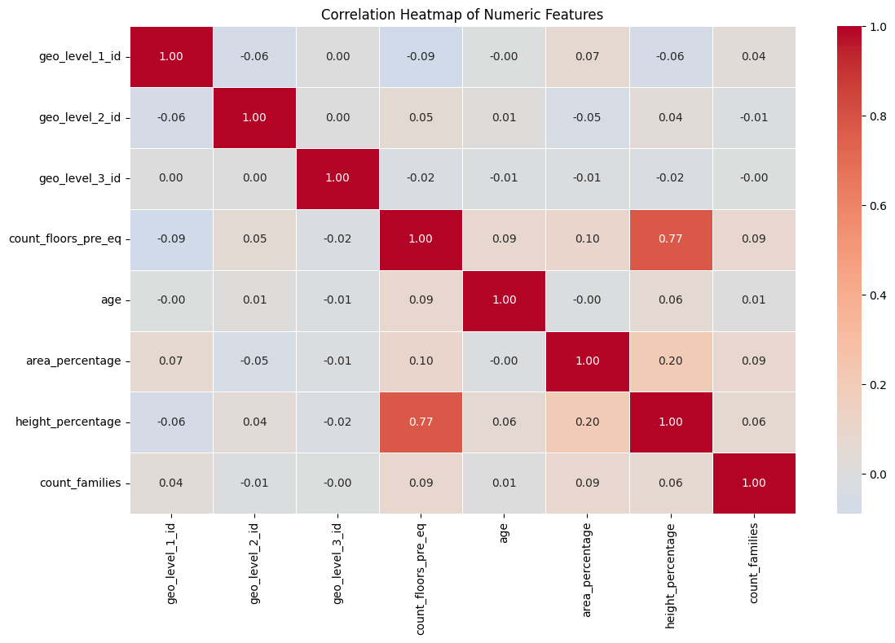

**Pairwise scatter matrix of numeric features, colored by `damage_grade`** (5,000-row random sample) — no single pair of numeric features cleanly separates the three damage grades visually, reinforcing the Section 9 finding that the numeric signal is weak and diffuse rather than concentrated in one or two features:

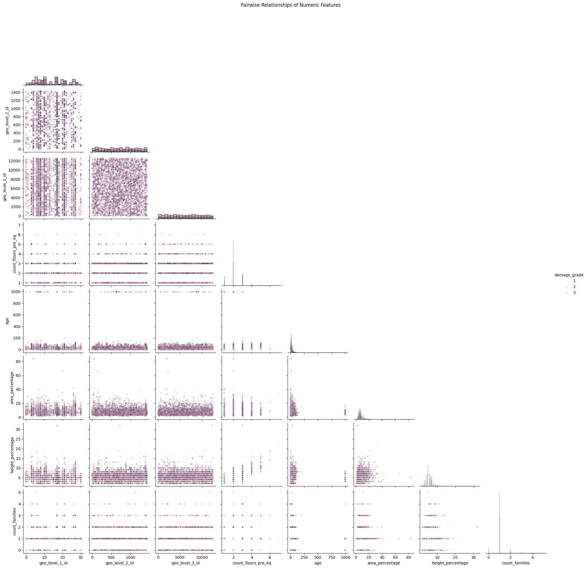

---

## Summary of Key Takeaways

1. **Data integrity is excellent** — no missing values, no duplicate IDs, and labels perfectly aligned to features (Sections 1–2).
2. **~11% feature-level duplication** exists but reflects genuinely similar buildings rather than a data error (Section 3).
3. **Target is imbalanced** (57% grade 2, 10% grade 1) — micro-F1, not accuracy, should drive model selection and evaluation, and stratified sampling should be used throughout (Section 4).
4. **Geo hierarchy is clean but high-cardinality**, with unseen categories in test at the finer levels — motivating out-of-fold target encoding rather than one-hot encoding (Section 5).
5. **`age` contains a placeholder value (995)** that should be treated as an outlier, not a real measurement (Section 6).
6. **Categorical columns are low-cardinality and fully covered in test** — safe for one-hot encoding (Section 7).
7. **Superstructure and secondary-use flags are internally consistent**, with `mud_mortar_stone` construction dominating the dataset (Section 8).
8. **`foundation_type` and geography carry the strongest signal**; numeric features show only weak linear correlation with damage, pointing toward tree-based / non-linear models as the better fit (Section 9).

These findings directly informed the cleaning and preprocessing pipeline implemented later in the notebook: dropping `age == 995` and IQR-based outliers (train only), one-hot encoding the 8 categorical columns, out-of-fold smoothed target encoding for the 3 geo columns, and MinMax scaling of continuous features.
